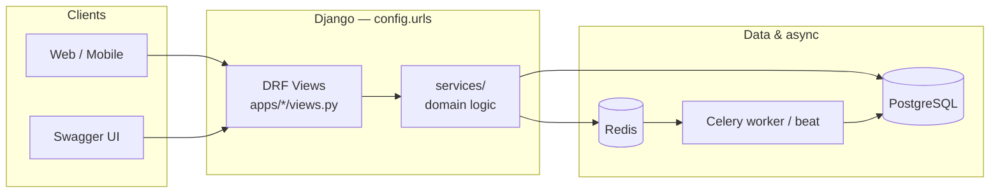

# Django SaaS Kit

[](https://github.com/abu-rayhan-alif/django-saas-kit/actions/workflows/ci.yml)
[](https://codecov.io/gh/abu-rayhan-alif/django-saas-kit)
[](LICENSE)
[](https://www.python.org/downloads/)
[](docker-compose.yml)
[](CHANGELOG.md)

Production-ready **Django SaaS starter**: multi-tenant RBAC, JWT auth, service layer,
Docker, Celery, and OpenAPI docs.

> **This boilerplate follows privacy-by-design principles.**  
> Treat personal data carefully, minimize collection, and align your deployment with
> applicable law — see the [EU GDPR overview](https://gdpr.eu/what-is-gdpr/) and your
> local privacy requirements before going to production.

## Quickstart

**Prerequisites:** [Docker](https://docs.docker.com/get-docker/) and [Docker Compose](https://docs.docker.com/compose/) (Docker Desktop on Windows/macOS includes both). [Git](https://git-scm.com/) and `make` (optional; Git Bash on Windows).

```bash
git clone https://github.com/abu-rayhan-alif/django-saas-kit.git
cd django-saas-kit
make dev
```

`make dev` copies `.env.example` → `.env` (if missing), builds images, and starts the stack.
Migrations run automatically via the container entrypoint.

| Check | URL |
|-------|-----|
| Health | http://localhost:8000/health/ (database + **Redis**) |
| **API docs (Swagger)** | **http://localhost:8000/api/docs/** |
| ReDoc | http://localhost:8000/api/redoc/ |
| OpenAPI schema | http://localhost:8000/api/schema/ |

Without `make`, run the same steps manually:

```bash
cp .env.example .env
docker compose up -d --build
```

Optional demo data: `make seed-demo` (see [Try it yourself](#try-it-yourself)).

## Architecture



| Layer | Responsibility |
|-------|----------------|
| **Views / serializers** | HTTP, auth headers, status codes, OpenAPI |
| **`services/`** | Business rules, validation, orchestration |
| **Models** | Schema, constraints, soft delete (`apps/common`) |
| **RBAC** | Tenant-scoped roles (`owner`, `admin`, `member`) |

Details: [Service layer guide](docs/architecture/service-layer.md) · [CUSTOMIZATION.md](CUSTOMIZATION.md) · [Observability](docs/observability.md) (`planned`: Sentry → Prometheus)

## Environment variables

Copy [`.env.example`](.env.example) to `.env` before running the app. Values below match the default Docker Compose stack.

| Variable | Required | Default (example) | Description |
|----------|----------|-------------------|-------------|
| `SECRET_KEY` | **Yes** | — | Django signing key; use a unique value per environment |
| `DATABASE_URL` | **Yes** | `postgres://saas_user:saas_pass@db:5432/saas_db` | PostgreSQL connection URL |
| `REDIS_URL` | **Yes** | `redis://redis:6379/0` | Cache backend |
| `DEBUG` | No | `True` | Debug mode (`False` in production) |
| `ALLOWED_HOSTS` | Prod/staging | `localhost,127.0.0.1,0.0.0.0` | Comma-separated hostnames |
| `DJANGO_SETTINGS_MODULE` | No | `config.settings.local` | Settings module (`local` / `staging` / `prod`) |
| `CELERY_BROKER_URL` | No | `redis://redis:6379/1` | Celery message broker |
| `CELERY_RESULT_BACKEND` | No | `redis://redis:6379/2` | Celery result backend |
| `JWT_ACCESS_TOKEN_LIFETIME_MINUTES` | No | `60` | Access token lifetime |
| `JWT_REFRESH_TOKEN_LIFETIME_DAYS` | No | `7` | Refresh token lifetime |
| `EMAIL_BACKEND` | No | `console` backend | Email delivery class |
| `DEFAULT_FROM_EMAIL` | No | `noreply@example.com` | Sender address |
| `SECURE_SSL_REDIRECT` | No | `False` | Force HTTPS (enable in production) |
| `FRONTEND_URL` | No | — | Base URL for password-reset links in email |
| `PASSWORD_RESET_TIMEOUT` | No | `3600` | Reset token lifetime (seconds) |
| `RUN_COLLECTSTATIC` | No | `false` | Run `collectstatic` on container start |

See [ADR-005](docs/adr/005-django-environ-vs-python-decouple.md) for how settings load variables.

## API documentation

Interactive **Swagger UI**: [http://localhost:8000/api/docs/](http://localhost:8000/api/docs/)

- Authenticate with **Authorize** → `Bearer <access_token>` from `POST /api/v1/auth/token/`
- All REST routes use the `/api/v1/` prefix ([versioning notes](#api-versioning))

## Try it yourself

```bash
make seed-demo
# or: docker compose exec web python manage.py seed_demo
```

| Item | Value |
|------|--------|
| Tenants | `tenant1`, `tenant2` |
| Demo login | `admin@tenant1.localhost` / `password123` |
| Tenant One UUID | `00000000-0000-4000-8000-000000000001` |

1. Open [Swagger](http://localhost:8000/api/docs/)
2. **Auth → POST /api/v1/auth/token/** — use the **Demo tenant admin login** example
3. **Authorize** with `Bearer <access>`
4. **RBAC → GET /api/v1/rbac/{tenant_id}/roles/** — use the **Tenant One UUID** example

## Features

- Multi-app layout: authentication, users, tenants, RBAC, notifications
- JWT (SimpleJWT) + registration + password reset
- Service layer + domain exceptions
- Docker Compose (web, PostgreSQL, Redis, Celery, beat)
- GitHub Actions: ruff, mypy, pytest, Docker build

## Start from this template

[Use this template](https://github.com/abu-rayhan-alif/django-saas-kit/generate) on GitHub to create your own repo, then `git clone` and `make dev`.  
See [Template setup checklist](docs/setup/template-repository.md).

## API versioning

| Resource | Base path |
|----------|-----------|
| Authentication (JWT) | `/api/v1/auth/` |
| Users | `/api/v1/users/` |
| Tenants | `/api/v1/tenants/` |
| RBAC | `/api/v1/rbac/` |
| Notifications | `/api/v1/notifications/` |

Future breaking changes will ship under `/api/v2/` without removing v1 until v2 is stable for one release cycle.

## Local development (without Docker)

```bash
python -m venv .venv
.venv\Scripts\activate          # Windows
# source .venv/bin/activate     # Linux/macOS
pip install -r requirements/local.txt
cp .env.example .env
# Point DATABASE_URL / REDIS_URL at local Postgres & Redis
python manage.py migrate
python manage.py runserver
```

## Production

```bash
cp .env.example .env
# DEBUG=False, strong SECRET_KEY, ALLOWED_HOSTS, SECURE_SSL_REDIRECT=True
docker compose -f docker-compose.prod.yml up -d --build
```

## Makefile

| Command | Description |
|---------|-------------|
| `make dev` | `.env` + start Docker stack (quickstart) |
| `make up` / `make down` | Start / stop stack |
| `make migrate` | Run migrations in web container |
| `make seed-demo` | Load demo tenants and admin user |
| `make redis-check` | Verify Redis (`REDIS_URL`) |
| `make test` | Run pytest |
| `make lint` | ruff + mypy |

## Extending the boilerplate

| Guide | Topic |
|-------|--------|
| [Add a new app](docs/how-to/add-new-app.md) | New Django app + service module |
| [Add a new RBAC role](docs/how-to/add-new-role.md) | Tenant roles |
| [Add a Celery task](docs/how-to/add-new-celery-task.md) | Background jobs |
| [Background jobs](docs/background-jobs.md) | Retry, idempotency, DLQ |
| [CUSTOMIZATION.md](CUSTOMIZATION.md) | All `TODO` extension points |

## Versioning

[Semantic Versioning](https://semver.org/) — see [CHANGELOG.md](CHANGELOG.md) and [docs/VERSIONING.md](docs/VERSIONING.md).

## Contributing

Contributions are welcome. Please read:

- **[Contributing guide](CONTRIBUTING.md)** — ticket flow (Jira → GitHub Issues), labels, PR checklist
- [Contributor Covenant](CODE_OF_CONDUCT.md)
- [GitHub Project board](docs/setup/github-project.md) — Backlog / In Progress / In Review / Done
- [Pull request template](.github/PULL_REQUEST_TEMPLATE.md)

## Security

Threat model (credentials, tokens, RBAC, replay) and responsible disclosure: **[SECURITY.md](SECURITY.md)**.

## License

This project is licensed under the **[MIT License](LICENSE)**.

Copyright (c) 2026 Abu Rayhan Alif
