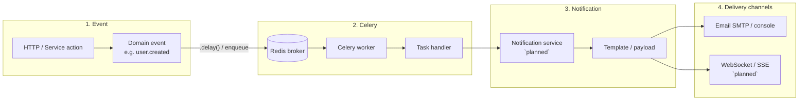
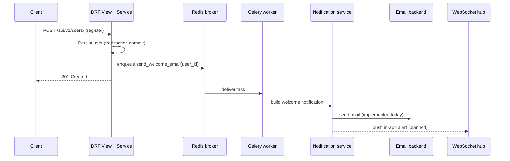

# Event-driven architecture

**Layer:** L2 | **Status:** Documented pattern (`planned` where noted)

This describes how **domain events** flow through the Django SaaS Kit: from something that happened in the system, through **Celery**, into the **notifications** layer, and out to **email** or **WebSocket** clients.

No full notification/WebSocket stack ships in the starter repo yet — this is the target architecture for forks and follow-up stories.

---

## Flow overview

**Sequence (happy path):**

---

## Component responsibilities

| Component | Responsibility |
|-----------|----------------|
| **Event** | Records *that something happened* (user registered, role assigned, invoice paid) after the database transaction commits — usually `transaction.on_commit` + `.delay()`, not inside the request thread. |
| **Celery** | Durable async execution: retries, backoff, and idempotency so delivery survives restarts and transient SMTP/API failures ([background jobs](../background-jobs.md)). |
| **Notification** | Turns a domain event into a channel-agnostic message (subject, body, recipient, tenant context, preferences) — **`planned`** as `services/notifications/` + `apps/notifications/`. |
| **Email** | Delivers to an inbox via Django `send_mail` / SMTP; used today for welcome and password-reset mail. |
| **WebSocket** | Pushes real-time updates to connected browsers (`planned` — e.g. Channels, SSE, or external Pusher/Ably). |

---

## What exists today vs `planned`

| Piece | Status | Example in kit |
|-------|--------|----------------|
| Domain action + `on_commit` | **Implemented** | `UserService.create_user` → `send_welcome_email.delay` |
| Celery worker + Redis | **Implemented** | `docker-compose.yml` `celery` service |
| Email delivery | **Implemented** | `WelcomeEmailService`, `PasswordResetService` |
| Notification service (router) | **`planned`** | `apps/notifications/` stub, empty routes |
| WebSocket / live feed | **`planned`** | Not in `INSTALLED_APPS` |
| Event bus (Kafka/Streams) | **Out of scope L2** | Celery + Redis is sufficient for most SaaS |

---

## Design rules

1. **Publish after commit** — never enqueue side effects before the DB transaction succeeds.
2. **Thin tasks** — Celery tasks call `services/`; no HTTP or DRF in tasks ([service layer](service-layer.md)).
3. **Idempotent handlers** — use `IdempotencyService` keys so retries do not double-send ([background jobs](../background-jobs.md)).
4. **Tenant context** — pass `tenant_id` in the event payload when notifications are tenant-scoped.
5. **Channel selection** — notification service decides email vs WebSocket from user preferences, not the originating API view.

---

## Example event (implemented)

| Step | Code |
|------|------|
| Event | User saved in `UserService.create_user` |
| Enqueue | `transaction.on_commit` → `send_welcome_email.delay(user_id)` |
| Celery | `apps/users/tasks.py` (retry + idempotency) |
| Email | `WelcomeEmailService` + `templates/emails/welcome.txt` |

Password reset follows the same pattern (request → service → email), synchronously in the HTTP path for the reset *request*, async optional for bulk mail.

---

## Related

- [Service layer](service-layer.md)
- [ADR 002 — Why Celery](../adr/002-why-celery.md)
- [How to add a Celery task](../how-to/add-new-celery-task.md)
- [Observability](../observability.md)
